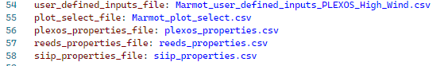

.. raw:: html

    

   

=======================================================
How to change default input files with the config.yml
=======================================================

This guide will show you how to best use the :ref:`config: yml file` to change the default input files, such as 
the :ref:`Marmot_user_defined_inputs: csv file` and :ref:`Marmot_plot_select: csv file`.

This will allow the user to quickly change between different versions of these inputs, without needing to change
the default files. This is particularly useful when working on different projects allowing the user to quickly 
change between project specific versions of the files.

The config.yml allows adjustment of many internal settings for Marmot and is explained in more detail in the 
:ref:`Input File Reference` section of this documentation.

.. note::
  This guide is only relevant if running Marmot directly as an application. By default, changing these settings 
  will have no affect when importing and using Marmot as a module. 

Default file locations and values
~~~~~~~~~~~~~~~~~~~~~~~~~~~~~~~~~~

By default, Marmot will look for the input files in the 
`Marmot/input_files <https://github.com/NREL/Marmot/tree/main/input_files>`_ directory.

.. image:: ../images/Default-input-files.png

Marmot uses the config.yml file to point to these input files and load them into the program, here is how they look
in the config.yml file.

.. image:: ../images/Default-input-files-config.png

Pointing to custom files
~~~~~~~~~~~~~~~~~~~~~~~~~

To make a custom version of a input file, simply copy the original file and save with 
your desired name in the same location.
Next update the config.yml file with custom file name. In the following example we have updated the 
**user_defined_inputs_file**: 

Custom files can be created for any of these input files. If the file exists in the input_files directory it will
be loaded.

If you wish to point to a custom input file that does not exist in the input_files directory, simply provide the full path 
to the file in the config.yml.
